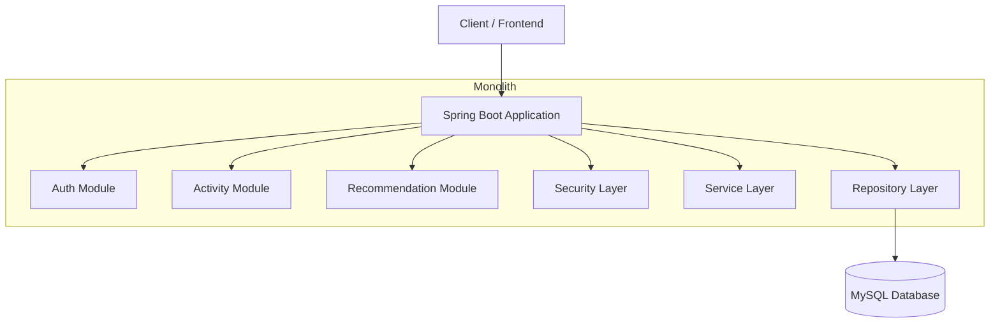
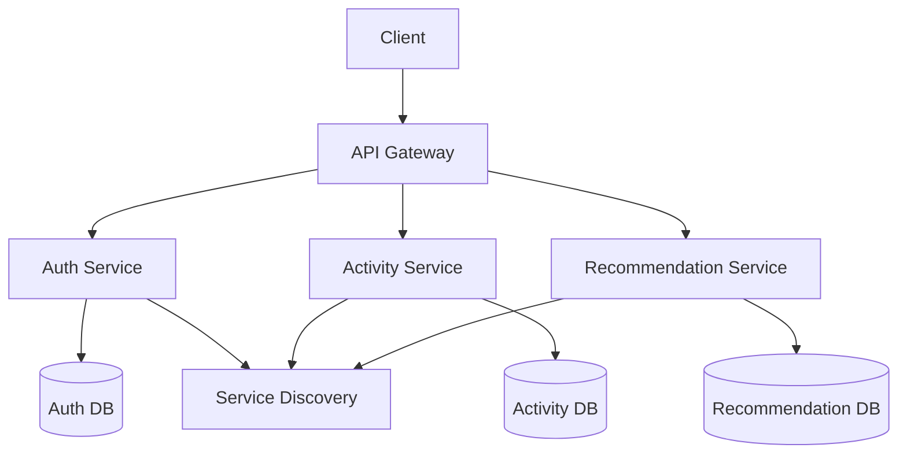

# 🏋️ SecureFit Platform API

## 📌 Overview
The **SecureFit Platform API** is a comprehensive backend application built using **Spring Boot**, designed to manage fitness tracking, workout routines, and health data. It provides a secure and scalable solution for fitness management with JWT-based authentication and role-based access control.

---

## 🚀 Tech Stack
- **Language:** Java 21  
- **Framework:** Spring Boot 4.0.3  
- **Database:** MySQL 8.0  
- **Security:** Spring Security with JWT Authentication  
- **Persistence:** Spring Data JPA (Hibernate)  
- **Documentation:** OpenAPI 3 (Swagger UI)  

---

## ✨ Key Features
- 🔐 JWT-based authentication with BCrypt password hashing  
- 🏃 Activity tracking (Running, Yoga, HIIT, Weight Training)  
- 📊 JSON-based flexible metrics storage  
- 🧠 AI-ready smart health recommendations  
- ⚠️ Global exception handling  

---

## 🏗️ Architecture Diagram

### 🔹 Monolith Architecture


---

### 🔹 Microservices Architecture (Future Scope)


---

## ⚙️ Setup & Installation

### 1️⃣ Clone the Repository
```bash
git clone https://github.com/HridaySharma2002/SecureFit-Platform-API.git
cd SecureFit-Platform-API
```

---

### 2️⃣ Database Configuration
```sql
CREATE DATABASE fitness_demo;
```

Update `application.properties`:
```properties
spring.datasource.url=jdbc:mysql://localhost:3306/fitness_demo
spring.datasource.username=root
spring.datasource.password=your_database_password
spring.jpa.hibernate.ddl-auto=update
```

---

### 3️⃣ Security Configuration
```java
private String jwtSecret = "${JWT_SECRET_KEY}";
```

Set environment variable:
```bash
export JWT_SECRET_KEY=your_secret_key
```

---

### 4️⃣ Run the Application
```bash
mvn spring-boot:run
```

---

## 📚 API Documentation
👉 http://localhost:8080/swagger-ui/index.html

---

## 📊 API Endpoints

| Category        | Endpoint                          | Method | Description                     |
|----------------|----------------------------------|--------|---------------------------------|
| Auth           | /api/auth/register               | POST   | Register user                  |
| Auth           | /api/auth/login                  | POST   | Login & get JWT                |
| Activity       | /api/activities                  | POST   | Add workout                    |
| Activity       | /api/activities                  | GET    | Get workouts                   |
| Recommendation | /api/recommendation/generate     | POST   | Generate advice                |

---

## 👨‍💻 Contact
- **Developer:** Hriday Sharma  
- **Email:** kshriday@gmail.com  
- **LinkedIn:** [hriday-sharma](https://www.linkedin.com/in/hriday-sharma-356056233/)  

---

## 📄 License
Apache License 2.0
